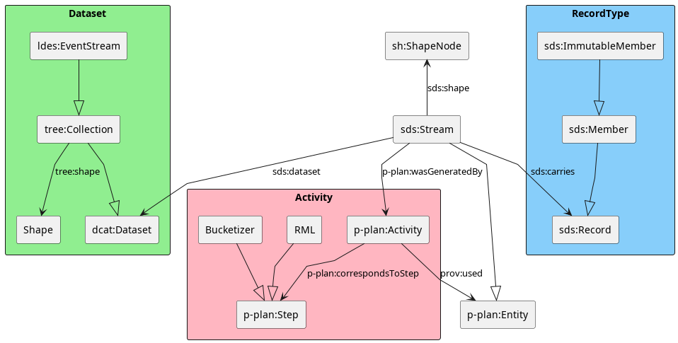

# Introduction

Data portals publish datasets, which can be derived from different datasets. This leads to a problem: when datasets are not accompanied by provenance information, the data portal has difficulty knowing whether or not this data is already published. Also, during dataset selection query agents are clueless as to what interfaces provide the same underlying data and as a fallback, they query the same underlying dataset multiple times. 

In a GPS application that notifies the user about changes in routes due to construction sites, multiple interfaces can be used. 
A time-based interface makes it easy to track the latest changes. 
On the other hand, a geospatial-based interface makes it easy to calculate whether or not a construction site will be encountered on a route.
A SPARQL endpoint can be the solution if low availability and operation cost are of no concern[@SPARQL].
Another possibility is to publish multiple Linked Data Event Streams (LDES)[@LDES].
Each stream can be fragmented in a different way to accommodate the needs of the users. 

<!-- helps the query agent understand that the datasets contain the same data and that the geospatial interface will be more efficient for this application. -->
Using different LDESes to publish different fragmentations of the same data exposes a plethora of interfaces which makes decent provenance a necessity. 
The provenance should cover the two steps a query agent takes to query an interface [@QueryDiscovery1;@QueryDiscovery2]:  

1. _Dataset discovery_: based on whether a dataset is going to contain statements that contribute to solving the query
2. _Interface discovery_: selecting the right interface that publishes the dataset

We set up a new interface for the Belgian street name registry and demonstrate that a query agent can find the optimal interface to execute particular queries.

# Related work

**DCTerms, DCAT and VoID**: Exposing metadata about datasets is long established. Dublin Core Terms (DCTerms) can be used to provide basic information about resources, providing terms like _title_, _author_, _description_ and _subject_[@DCTerms]. Data Catalog Vocabulary (DCAT) is designed to facilitate interoperability between data catalogs published on the web[@DCAT]. DCAT also provides terms like _license_, which makes it possible to define a new license for an interface. The Vocabulary of Interlinked Datasets (VoID) focuses on explicitly linking datasets together on some predicate and defining subset datasets[@VOID].

**LDES**: Linked Data Event Streams is a way of exposing immutable objects with HTTP resources. These resources can be divided into fragments that are linked together. Fragmentations are used to spread the items over different HTTP resources. Each HTTP resource can, for example, hold all items that start with a particular letter. A view description describes the meaning of the fragments and their links[@LDES].   <!-- this is a reference to LDES paper -->

**VoCaLS**: Vocabulary of interoperable streams & On a Web of Data Streams (Dell Aglio): extends the ideas of DCAT with more information about streaming data[@VoCaLS]. The work defines a stream slightly differently than in this paper. VoCaLS focuses on streams that generate high throughput updates, this requires processors to use a windowing mechanism. In this paper, a stream is seen more broadly as a growing collection of objects, updates or otherwise.

**P-Plan and PROV-O**: The Ontology for Provenance and Plans (P-Plan) is an extension of the PROV-O ontology [@PROVO] created to represent the plans that guided the execution of scientific processes. P-Plan describes how the plans are composed and their correspondence to provenance records that describe the execution itself [@PPLAN].

# The Smart Data Specification for Semantically Describing Streams (SDS)

<!--stream is een live kanaal met updates, de dataset is dan het geheel van alle updates samen-->
A stream in the context of SDS is a _physical_ live channel that carries updates or items. A dataset can be derived from a stream as the collection of all updates or items. A _physical_ channel can be any medium like a Kafka stream, WebSocket stream or even a file where updates are appended. A stream can carry any data: CSV rows, mutable or immutable linked data objects, video stream bytes, etc.

<!--een stream kan gemaakt worden van een andere stream na een transformatie. Deze transformatie wordt omschreven in de SDS description. Zo kan je informatie vinden over de net gevonden stream (stub naar source selection in query agents)-->
A stream can be derived from a transformation applied to items on a different stream. This transformation should be described with `p-plan` in the SDS description that is part of the resulting stream. The stream and the transformation correspond with `p:plan:Entity` and `p-plan:Activity` respectively. This is shown as the pink part of Figure \ref{onto}. The transformation can  `prov:used` a different stream.
With the power of the `p-plan`, query agents can understand how datasets are linked and what interface fits a specific query the best.

<!--sds dataset verwijst naar metadata over de dataset dat opgebouwd wordt door deze stream-->
The SDS description can be expanded with metadata about the dataset collected from the stream with the `sds:dataset` predicate. This way parts of the datasets' metadata can be changed after a transformation. This is represented as the green part in Figure \ref{onto}. 

<!--sds Record zijn objecten dat dataset objecten verbinden aan de huidige stream. Nuttig want dan kan je met een transformatie (meta)data toevoegen aan sds Record, maar niet aan de dataset. (stub bucketization)-->
<!--   push only data structure: je kan informatie over meerdere streams op dezelfde push only data structure zetten, zoals gewoon appenden naar een file-->
Linking specific items to the correct stream is done with `sds:Record`. An `sds:Record` points to the data (`sds:payload`) and the corresponding stream (`sds:stream`). These small objects make it possible for multiple streams to use the same channel. Each transformation can thus push `sds:Record`'s and leave the original stream intact. A stream of immutable objects can still be transformed. This transformation can, for example, calculate a hash or add a fragment id to the `sds:Record` object. The yellow part of Figure \ref{onto} gives a visual overview of `sds:Record`.

<!--  Figuurtje ofzo met de ontology -->

# Demo

Data published with Linked Data Event Streams can be partitioned or fragmented in a multitude of ways. This helps query agents resolve their queries with as few web requests as possible. A default fragmentation constitutes a timestamp fragmentation, this allows clients to replicate and synchronize the dataset efficiently. A substring fragmentation, on the other hand, makes autocompletion more efficient[@Substring].

In this demo, we set up a pipeline starting from an existing LDES that exposes the registry of street names with a timestamp fragmentation. The pipeline calculates a substring fragmentation based on the name of the street and exposes a new LDES with the corresponding SDS Description.

When asking a query agent "What are the 10 latest updated street names?" starting from the newly created LDES, the query agent can derive from the SDS description that the current LDES is not suitable for this query. This query would require the query agent to request the entire LDES tree and manually find the 10 latest updates, whereas following the links from the SDS description back to the original LDES, this query would only require a few HTTP requests. One HTTP request gets the SDS description. The other requests get the latest updates due to the timestamp-based fragmentation. 

Note that the original LDES does not expose an SDS description, so this has to be bootstrapped in the pipeline.

To execute this pipeline we use a proof of concept pipeline runner called Nautirust[@Nautirust]. This makes it easy to start the three required processes with the correct arguments. The three required steps are: read the original LDES with an LDES client, add buckets to the SDS Records and ingest the new SDS records in an LDES server.

# Conclusion

With the introduction of the SDS ontology, it is possible to add a description to a stream and the resulting dataset, that provides provenance. The provenance links streams together and transformations applied to the stream. The SDS ontology aligns well with well-established ontologies like DCAT and P-Plan to maximize interoperability.

The SDS description makes it possible for query agents to automatically select the right dataset and interface based on a given query.

Federated query processors, that utilize source selection based on this provenance information when selecting a dataset and interface to query the dataset, are still future work. 

# Acknowledgments

Funded by the Flemish government’s recovery fund VSDS project: the "Vlaamse Smart Data Space".
