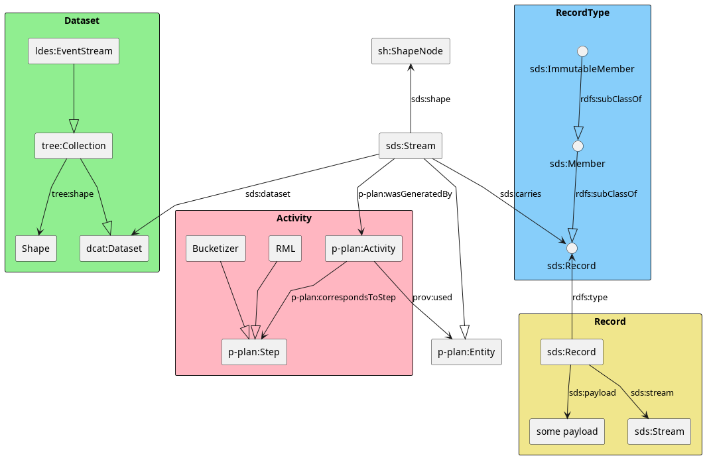

## Introduction

Datasets exist all around us, yet the perfect dataset interface does not exist. Many organizations derive new dataset interfaces that better fit their goal. Sometimes they even republish this dataset. Without provenance, it is impossible to see the correlation between the dataset interfaces. Reinventing the wheel is a tedious process, so it is not desirable to create a new interface for the same dataset for each required query.

For example, an application exists that sends a notification warning to the user that a new construction site forces a new route to school. There exists a dataset about all construction sites. This dataset is also published with an interface that makes geospatial querying easier. Thus the application has two ways to get the same answer but wants to use the most efficient interface. Adding provenance to these datasets makes dataset discovery easier.

<!-- helps the query agent understand that the datasets contain the same data and that the geospatial interface will be more efficient for this application. -->
Query agents determine the most proficient interface to query against in two steps:  
 1. Dataset discovery: based on whether a dataset is going to contain statements that contribute to solving the query
 2. Interface discovery: selecting the right interface from interfaces publishing the same dataset

<!-- let’s have 2 distinct running examples? E.g., Sensor data and an address registry? -->
In this paper, we set up a new LDES of the street name registry. We demonstrate that a query agent can find the optimal interface to query particular queries.

## Related work

**DCterms, DCAT and VoID** Exposing metadata about datasets is long established. Dublin Core Terms can be used to provide basic information about resources, providing terms like _title_, _author_, _description_ and _subject_. Data Catalog Vocabulary is designed to facilitate interoperability between data catalogs published on the Web. DCAT also provides terms like _license_ which is important when publishing a different interface. The Vocabulary of Interlinked Datasets focuses on explicitly linking datasets together on some predicate and defining subset datasets.

**LDES** Linked Data Event Streams is a way of exposing immutable objects with HTTP resources. These resources can be divided into fragments that are linked together. A view description describes the meaning of the fragments and their links @LDES. <!-- this is a reference to LDES paper -->

stub: Vocabulary of interoperable streams (Tomassini) & On a Web of Data Streams (Dell Aglio): extends the ideas of DCAT-AP with more information about streaming data. The work defines a stream slightly different than in this paper though as it is used for datasets that generated updates that quickly that a query processor should use a windowing mechanism to answer queries over it. In this paper, we want to see the concept of a stream more broadly... 

P-Plan [...] 

## The Smart Data Specification for Semantically Describing Streams (SDS)

<!--stream is een live kanaal met updates, de dataset is dan het geheel van alle updates samen-->
A stream in the context of SDS is a _physical_ live channel that carries updates or items. A dataset can be derived from a stream as the collection of all updates or items. A _physical_ channel can be any medium like a Kafka stream, WebSocket stream or even a file where updates are appended. As a side note, a stream can carry any data: CSV rows, (im)mutable linked data objects, and video stream bytes, to name a few.

<!--een stream kan gemaakt worden van een andere stream na een transformatie. Deze transformatie wordt omschreven in de SDS description. Zo kan je informatie vinden over de net gevonden stream (stub naar source selection in query agents)-->
A stream can be derived from a transformation applied to items on a different stream. This transformation should be described with `p-plan` in the SDS description that is part of the resulting stream. The stream and the transformation correspond with `p:plan:Entity` and `p-plan:Activity` respectively. The transformation `prov:used` a different stream.
With the power of the `p-plan`, query agents can understand how datasets are linked and what interface fits a specific query the best.

<!--sds dataset verwijst naar metadata over de dataset dat opgebouwd wordt door deze stream-->
The SDS description can be expanded with metadata about the dataset collected from the stream with the `sds:dataset` predicate. This way parts of the datasets' metadata can be changed after a transformation. 

<!--sds Record zijn objecten dat dataset objecten verbinden aan de huidige stream. Nuttig want dan kan je met een transformatie (meta)data toevoegen aan sds Record, maar niet aan de dataset. (stub bucketization)-->
<!--   push only data structure: je kan informatie over meerdere streams op dezelfde push only data structure zetten, zoals gewoon appenden naar een file-->
Linking specific items to the correct stream is done with `sds:Record`. An `sds:Record` points to the data and the corresponding stream. These small objects make it possible that multiple streams to use the same channel. Each transformation can thus push `sds:Record`'s and leave the original stream intact. A stream of immutable objects can still be transformed, this transformation can for example calculate a hash or add a bucket parameter (ref needed) to the `sds:Record` object.

<!--  Figuurtje ofzo met de ontology -->

<!-- Maybe inclode Wout’s work here? -->
We introduce the term snapshot for 

Can be version materialized or not

## Demo

Data published with Linked Data Event Streams can be partitioned or fragmented in a multitude of ways. This helps query agents resolve their queries with as few web requests as possible. A default fragmentation constitutes a timestamp fragmentation, this allows clients to replicate the dataset efficiently. A substring fragmentation, on the other hand, makes autocompletion efficient (cite needed).

In this demo, we set up a pipeline that takes an existing LDES that exposes the registry of street names with a timestamp fragmentation. The pipeline calculates a substring fragmentation based on the name of the street and exposes a new LDES with the corresponding SDS Description.

When asking a query agent "What are the 10 latest updated street names?" starting from the newly created LDES, the query agent can derive from the SDS description that the current LDES is not suitable for this query. This query would require the query agent to request the entire LDES tree and manually find the 10 latest updates, whereas following the links from the SDS description back to the original LDES this query would only require one or two HTTP requests.

Note that the original LDES does not expose an SDS description, so this has to be bootstrapped in the pipeline.

To execute this pipeline we use a proof of concept pipeline runner called Nautirust. This makes it easy to start the three required processes with the correct arguments. The three required steps are: read the original LDES with an LDES client, add buckets to the SDS Records and ingest the new SDS records in an LDES server.

## Conclusion

 * Introduce SDS:stream and a description of what it carries
 * [*] Alignment with DCAT and P-Plan

This way, we make data pipelines transparent so that querying agents can automatically select the right dataset and interface based on a given query.

## Acknowledgments

Funded by the Flemish government’s recovery fund VSDS project: the "Vlaamse Smart Data Space".

